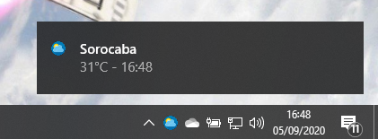

<!-- Pedro Tortello sep/2020 -->
## Wheater Notifier
This application reports current temperature for the choosen location through Windows 10 notifications.

#### Objective
The main purpose of this project is to improve my Python skills.

I have learned some new libraries, as bs4, win10toast and requests.

#### Features
The interval of time between reports are selected by the user.

The only location avaiable for now is my hometown Sorocaba (São Paulo/Brazil).

#### TO-DO List
- user settings
- forecast info
- icon change by climate
- fix compound names bug
